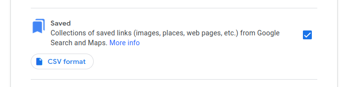

# Convert Saved places from Google Maps to GeoJSON
(beyond the Starred places)
1. [Use Google Takeout](https://takeout.google.com/settings/takeout?pli=1) to export the CSV.

Make sure to click this, as it's not obvious it actually has places from your Maps:

1. Enable [Maps Places API](https://console.cloud.google.com/apis/library/places-backend.googleapis.com) in your GCP

1. Create a new [API Key](https://console.cloud.google.com/apis/credentials) to use the API 

1. `npm install`
   
1. `export GOOGLE_MAPS_KEY=<google-api-key>`

1. `./google-bookmarked-places-to-geojson.js coolest-places.csv > coolest-places.json`

1. Enjoy interoperability of `coolest-places.json` in GeoJSON
